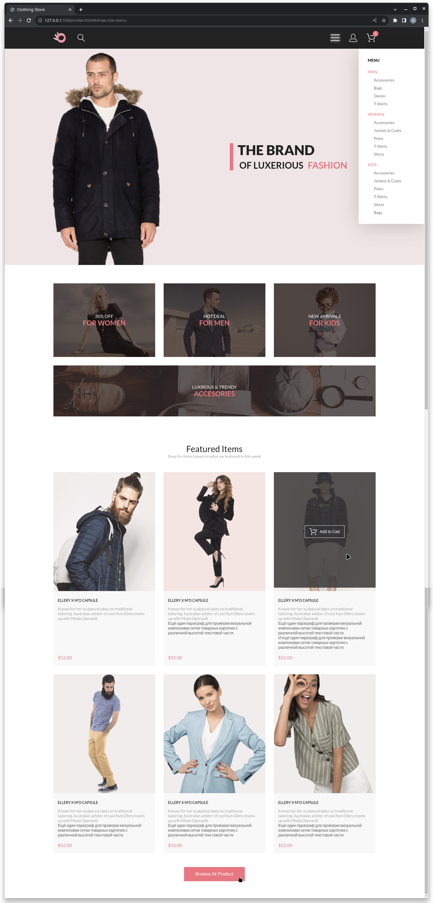

# Задание №6: Создание нового адаптивного проекта

Полностью реализовать вёрстку проект

1. Добавить весь контент из макета
2. Ко всем элементам контента добавить классы
3. Добавить стили для всего контента сайта
4. Расставить элементы в соответствии с макетом
5. Адаптив создавать не нужно

## Решение

[Директория проекта ./hw6_new_site/](hw6_new_site/)

## Рендер страницы в браузере

